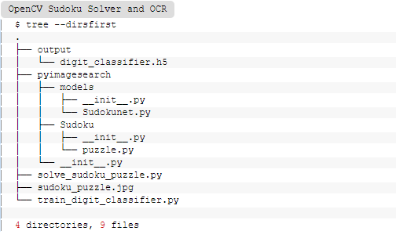

1. Project structure 

- Sudokunet.py : kiến trúc CNN được triển khai với Keras và Tensorflow
- puzzle.py : Bao gồm 2 tiện ích giúp để tìm Sudoku puzzle ( câu đố) board cũng như các digit trong bảng đó 
- train_digit_classifier.py : train để tìm ra digti trong cell là digit gì và lưu model 
- solve_sudoku_puzzle.py : thực hiện chương trình , giải đố một bài toán sudoku